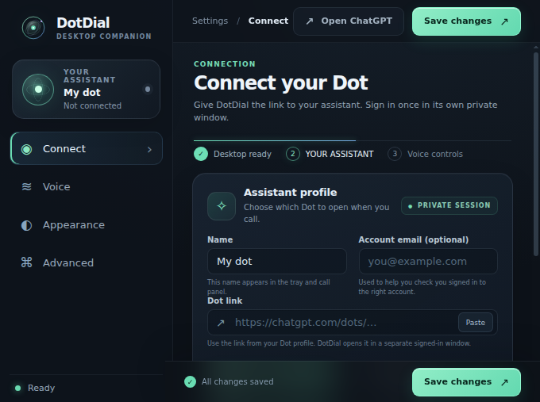
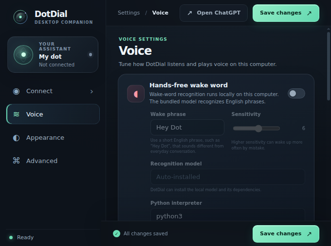
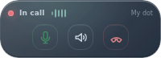

<p align="center"></p>

# DotDial

[](LICENSE) 

**A little phone for your ChatGPT dot — voice activation, quiet mode and missed replies. Linux.**

DotDial is an experimental Linux desktop companion for calling a dot from a tray icon or keyboard shortcut. It can mute the microphone or speakers, save incoming replies locally while speakers are muted, and play saved replies in order. Optional offline wake-word support is available. One ordinary JSON file holds all settings, so your coding agent can configure the app with its usual file tools.

> DotDial is an unofficial community project, not an OpenAI product. The call adapter currently uses internal ChatGPT web routes rather than a supported public voice API. OpenAI may change those routes at any time; see [Privacy](docs/PRIVACY.md) and [Releasing](docs/RELEASING.md).

[Agent and config guide](docs/AGENT.md) · [Privacy](docs/PRIVACY.md) · [Security](SECURITY.md)

## Preview

These screenshots are from the local synthetic demo. They do not show a live call or a real account.







## What it does

- Calls the dot you choose from the tray, a hotkey, or a wake phrase; the floating panel controls the call.
- Keeps microphone mute and speaker mute separate.
- Stores incoming voice locally only while speaker output is muted and recording is enabled. It does not record the microphone or create a transcript.
- Plays saved replies oldest first. A clip is deleted only after it finishes; stopping playback keeps it for another try.
- Offers an optional offline English wake word. It is disabled by default and requires a separate model download.
- Uses your existing ChatGPT account through a sign-in window owned by DotDial. No API key is needed.

The demo opens settings with simulated call states and does not sign in, contact ChatGPT, start a call, or access a microphone.

## Linux x86_64 beta

DotDial is currently built for Linux x86_64. Electron 44.5.1 supplies the desktop runtime. Your Linux desktop must have the normal Electron GTK, audio and display libraries installed.

### Run from source

Requirements: Node.js 22.12 or later, npm, and a Linux desktop session.

```sh
npm ci
npm start
```

Open Settings, paste the URL of your dot, then use **Sign in** to sign in to ChatGPT in DotDial's own window. Use an account that already has access to the dot. To start a call, select **Call** or use the configured hotkey.

For a credential-free visual preview:

```sh
npm run demo
```

### Install a release build

Download the Linux x86_64 `.deb` or `.tar.gz` from GitHub Releases. The beta artifacts are named `dotdial_0.1.0-beta.1_amd64.deb` and `DotDial-0.1.0-beta.1-linux-x64.tar.gz`.

For Debian or Ubuntu:

```sh
sudo apt install ./<downloaded-DotDial-file>.deb
```

For the archive, extract it and run its installer:

```sh
tar -xzf DotDial-0.1.0-beta.1-linux-x64.tar.gz
./DotDial-linux-x64/install.sh
```

The installer requests `sudo` when needed, places the app in `/opt/dotdial`, and adds the `dotdial` command, desktop entry, and icon. It also sets the Chromium sandbox owner and permissions required by Ubuntu. Do not launch `DotDial-linux-x64/dotdial` directly from the extracted archive there: the archive cannot preserve a root-owned sandbox. Launch DotDial from the desktop menu or run `dotdial` after installation. The archive installer only handles a clean install and refuses to replace existing DotDial paths.

### Optional offline wake word

Wake-word support is off by default. It uses an English model locally; it does not send microphone audio to a wake-word service. To install the pinned Python packages and download the model:

```sh
sudo apt install python3 python3-venv libportaudio2
python3 scripts/setup-wake.py
```

Enable wake word in Settings and select a supported English phrase, for example **Hey Dot**. Setup stores the model and its virtual environment in DotDial's user data directory, verifies the model archive's SHA-256, and preserves the upstream model files. See [Third-party notices](THIRD_PARTY_NOTICES.md).

## Configuration and local data

DotDial validates a single versioned JSON configuration file at `${XDG_CONFIG_HOME:-~/.config}/dotdial/config.json`. Settings are also available in the app. The [agent guide](docs/AGENT.md) documents the schema, CLI, and safe concurrent updates.

| Data | Default location |
| --- | --- |
| Settings | `~/.config/dotdial/config.json` |
| Logs, call and window state | `~/.local/state/dotdial/` |
| Browser sign-in profile, recordings, wake model | `~/.local/share/dotdial/` |
| Cache | `~/.cache/dotdial/` |

The floating panel remembers its position across restarts. If a monitor is disconnected or its resolution changes, the panel stays within the available screen area. Its last position is local runtime state in `panel-position.json` under the state directory.

XDG environment variables relocate these directories. Recordings are local WAV files. They remain after the app closes and after package removal; delete user data only when you also want to remove the saved sign-in profile and any unplayed replies.

## Uninstall

- Debian/Ubuntu package: `sudo apt remove dotdial`.
- Archive installed with `install.sh`: quit DotDial, then use `sudo` to remove `/opt/dotdial`, `/usr/bin/dotdial`, `/usr/share/applications/dotdial.desktop`, and `/usr/share/icons/hicolor/scalable/apps/dotdial.svg` (these are the files created by the installer).
- Archive that was only extracted: remove the extracted folder.
- Source install: quit DotDial, then remove the source checkout.

These steps preserve your settings, sign-in profile, and recordings. To erase all DotDial user data as well, first keep any recordings you still need, then remove the DotDial directories under your XDG config, state, data, and cache homes. See [Privacy](docs/PRIVACY.md) for their contents.

## Contributing and license

See [CONTRIBUTING.md](CONTRIBUTING.md) for local checks and [SECURITY.md](SECURITY.md) for vulnerability reports. DotDial is distributed under the MIT License; third-party components keep their own licenses and notices.
